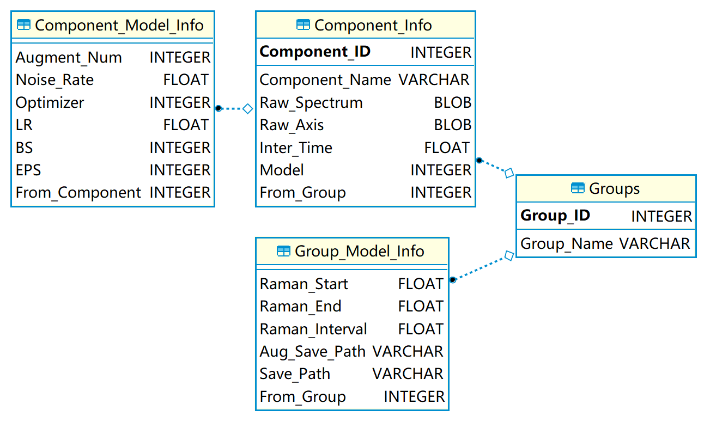
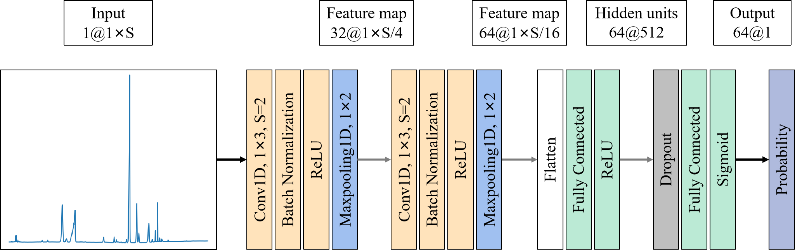
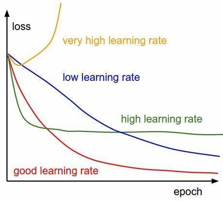

.. _Basic Concepts:

Basic Concepts
==============

Database
--------

The Raman spectra are stored in the SQLite database for better scaling, productivity and easy maintenance. The schema of the SQLite database is shown as follows:

EasyCID can extract the spectral information from raw Raman spectra in SPC, JCAMP-DX and TXT formats. Then, the extracted information, such intensity and Raman shift, is inserted into the database. Those Raman spectra are divided into groups for specific tasks. The database can also records the training information of the CNN model, which facilitates the tuning of the models. These information can be retrieved from the database for data augmentation, training and prediction.

Data Augmentation
-----------------

Data augmentation can generate enough spectra to train deep neural networks and improve the generalization ability of models. 

For the spectrum of each compound in a database, its augmented spectra were obtained by adding different pure spectra at random ratios with random Gaussian noise. There are two types of augmented spectra: positives and negatives. For positives, the spectra of the other interference compounds were randomly combined with the spectrum of the selected compound, and the ratio of the selected compound in each augmented spectra was set as not less than 10 percent. For negatives, spectra (without the selected component) were randomly sampled from the spectral database, and their ratios were also randomly generated. 

Then, these spectra were summed according to the ratios. For each augmented spectra, the noise level (standard deviation of Gaussian noise) was equal to the product of the maximum value of the spectrum and the noise rate. The number of components for augmenting spectra ranged from 2 to the max number of components, which is a parameter that can be adjusted by users. The ratio of the augmented spectra of different max number of components was determined by their combinatorial numbers. For example, when the total number of components is 13 and the max components is 4. For positives, the ratio of the augmented spectra with different max number of components from 2 to 4 is equal to C(1,12):C(2,12):C(3,12). For negatives, the ratio is equal to C(2,12):C(3,12):C(4,12). 

Finally, the augmented spectra were randomly divided into the training, validation, and test sets in the ratio of 8:1:1.

CNN models
----------

CNN can extract the features of the spectra and learn to identify components of unknown spectra of mixtures. 

one-dimensional CNN with six hidden layers is used. The convolution layers are used to extract the features of spectra, which consists of a one-dimensional convolution, batch normalization and rectify linear unit (ReLU) function. Each convolution layer is followed by a pooling layer, which eliminates noisy information and reduce the amount of data. The fully connected layer are used as a classifier to determine the existence of the component based on the extracted features, where ReLU is used as the activation function in first layer while Sigmoid is used in second layer. Between two fully connected layers, Dropout is used to increase the generalization ability of the model. Binary cross entropy is used as the loss function.

.. _Hyperparameters of CNN models:

Hyperparameters of CNN models
-----------------------------

From all the adjustable hyperparameters for training CNN models, we selected the most important ones for the training step to reduce the learning cost for non-machine-learning experts. 

	* EasyCID offers four adaptive optimizers, and the default **Adam** optimizer typically requiring no tuning or little fine-tuning to accommodate a wide range of deep learning tasks.

	* **Learning rate** is the most important hyperparameter for training CNN model. Its value can be adjusted by combining the training report given on **Training Report Window** and referring to the following figure:

It is recommended to set the initial learning rate from 0.0001 to 0.001.

	* **Batch size** affects the optimization degree and speed of the algorithm, and it depends on the size of the GPU/CPU memory. 

	* It's better to set the **epochs** larger since the early stopping strategy was applied in training process. When the performance of the model does not improve within a certain period, this strategy will terminate the training process and save parameters with optimal performance of all time.

Baseline Subtracted
-------------------

Adaptive iteratively reweighted penalized least squares (airPLS) is used as the baseline subtracted method that works by iteratively changing weights of sum squares errors between the fitted baseline and original signals.

The details for airPLS can be seen at `Baseline correction using adaptive iteratively reweighted penalized least squares <https://doi.org/10.1039/B922045C>`_

Spectral Smoothing
------------------

Whittaker smoother is a spectral smoothing method that based on penalized least squares, which obtains smoothed data by adjusting the weight between the fidelity and roughness of data.

The details for Whittaker smoother can be seen at `A Perfect Smoother <https://doi.org/10.1021/ac034173t>`_

Regression Analysis
-------------------

Non-negative elastic net is used to determine the relative ratio of each pure component in the mixture. The method can be treated as a hybrid of lasso[37] and ridge regression, which combines both the L1 and L2 regularization to improve the regularization of statistical models. Considering the concentration of the compound should be non-negative, the non-negative restrictions is imposed to make the results more reasonable. 

The details for Non-negative elastic net can be seen at `Mixture analysis using non-negative elastic net for Raman spectroscopy <https://doi.org/10.1002/cem.3293>`_ 
